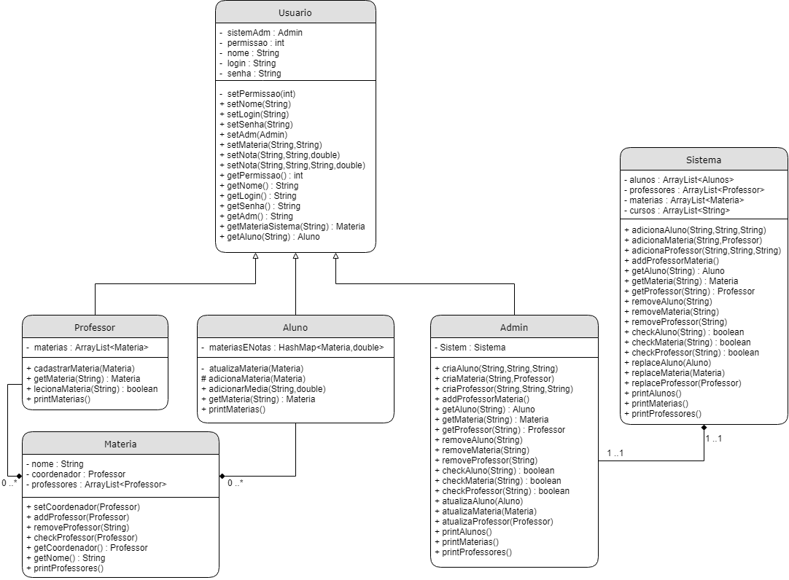

# Students performance evaluation interface (Interface de desempenho acadêmico de alunos)

This project started as an evaluation of our laboratories of OOP.
The goal was to have an idea and create it on a 5 month period using OOP in java.
Our idea was to create a platform to evaluate the students performance in order to facilitate hiring for companies that need specific knowlege about a topic.

**College:** FEI

**Group:** 
  * Pedro Henrique Silva Domingues R.A.: 22.218.019-2
  * Kaike Rodrigues Zuanetti       R.A.: 22.118.116-7
  * Ibrahim Jamil Orra             R.A.: 22.118.183-7
  * Matheus Guedes                 R.A.: 22.118.072-2

**Project Idea:**

---------------------------------------------------------------------

**UML:**

