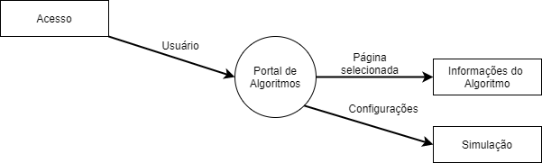
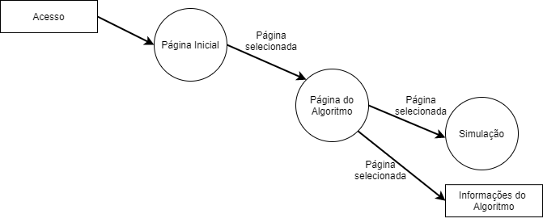

Sumário:
========

- [Grupo](#grupo)
- [Links](#links)
- [Introdução](#introdução)
- [Desenvolvimento](#desenvolvimento)
  1. [Sprints](#sprints)
  2. [Requisitos](#requisitos)
  3. [Tabela Canvas](#tabela-canvas)
  4. [Planejamento](#planejamento)
      * [DFD](#dfd)
      * [MER](#mer)
      * [Conceitos Iniciais](#conceitos-iniciais-do-site)
  5. [Ponto de função](#ponto-de-função)
      * [Fator Complexidade](###Fator-Complexidade)
      * [Fator Ajuste](###Fator-Ajuste)
  6. [Testes](#teste)
    * [Caixa Preta](#caixa-preta)
    * [Matriz de teste](#matriz-teste)
    * [Caixa Branca](#caixa-branca)
- [Bibliografia Utilizada](#bibliografia)
- [Imagens](#imagens-externas-utilizadas)

-------------------------------------------------------------------------------

# Grupo

|   Cargo   |  Nome  |  R.A.  |
|   :---:   |  :---: |  :---: |
|  Scrum Master  |  Pedro Henrique Silva Domingues  |  22.218.019-2  |
|  P.O.  |  Rafael Felipe Lino  |  22.118.182-9  |
|  Dev. Team  |  João Victor da Silva Couto  | 22.118.022-7  |
|  Dev. Team  |  Kaike Rodrigues Zuanetti  |  22.118.116-7  |
|  Dev. Team  |  Felipe Maciel de Sousa  |  22.218.042-4  |

-------------------------------------------------------------------------------

# Links

- [Trello](https://trello.com/b/rQ9d7zP6/eng-software) - Kanban com a organização das tarefas
- [Site](https://12pedro07.github.io) - Link de facil acesso ao site hospedado no próprio github
- [Forms](https://docs.google.com/forms/d/1uBkIgZ2C1a4m5CCoAonrmNfk55EAgYLl1q4AhJtLzbQ/edit#responses) - Dados coletados via google forms

-------------------------------------------------------------------------------

# Introdução

   O intuito deste trabalho é aprender e aplicar conceitos de engenharia de software e metodologia ágil. Assim sendo, devemos desenvolver um projeto que aplique os conceitos aprendidos ao decorrer do semestre letivo.
   
   Nosso projeto constitui-se na construção de um site chamado "Passei no Guilherme!", o qual possui foco acadêmico e objetivo de auxilio a professores e principalmente alunos. Nosso foco é criar uma plataforma na qual alunos possam compreender o conteúdo da disciplina de análise e complexidade de algoritmos de forma completa, interativa e visual, para que a compreensão de conceitos abstratos e normalmente de dificil compreensão para a maioria dos estudantes, torne-se mais interessante e simples.
   
   O site sera hospedado no GitHub e desenvolvido utilizando HTML, CSS e Java Script.
  
-------------------------------------------------------------------------------

# Desenvolvimento

## Sprints
  
  Todas as sprints podem ser acompanhadas no [Trello](https://trello.com/b/rQ9d7zP6/eng-software), mas estão também aqui resumidas.
  
  ### Primeira Sprint (04/03 ~ 18/03)
  
  Realizamos na primeira sprint a montagem dos primeiros diagramas de desenvolvimento, preparamos também um modelo de design inicial que utilizaremos como base para as sprints decorrentes.
  
  ### Segunda Sprint (18/03 ~ 01/04)
  
  Na segunda Sprint pesquisamos e escrevemos a teoria relativa a cada um dos algoritmos, para que seja realizada a montagem das páginas no site, como pode ser identificado no DFD nível 2 que refina "página do algoritmo".
  
  ### Terceira Sprint (01/04 ~ 15/04)
  
  Na terceira Sprint terminamos a escrita que foi iniciada na segunda sprint, juntamos imagens, gifs e demais arquivos necessários para o site e iniciamos a programação e modelagem deste. Junto a isso, começamos a realizar a montagem dos diagramas de teste.
  
  ### Quarta Sprint (15/04 ~ 29/04)
  
  Na quarta Sprint foi feito calculo do ponto de função, com seus respectivos fatores. O dev team integrou ao site os textos pesquisados e escritos para cada algoritmo, criando uma página para cada um destes e realizando o direcionamento destas apartir da home.
  
  ### Quinta Sprint (29/04 ~ 13/05)

  A quinta e ultima Sprint constituiu-se da finalização do site, integração da simulação, realização do teste de caixa branca e conclusão da documentação presente neste arquivo.

## Requisitos

  O primeiro passo do desenvolvimento foi o levantamento dos requisitos, para isso foram criadas 8 perguntas que nos auxiliaram a compreender as preferencias do nicho dos clientes. Estas foram disponibilizadas via [google forms](#links) para serem preenchidas em escala likert, o formulario criado foi divulgado com auxilio do professor Guilherme Wachs.

## Tabela Canvas

  Após o levantamento dos requisitos, para criar o planejamento inicial do projeto o grupo fez o levantamento de uma tabela canvas com base no modelo sebrae, como ilustrado abaixo.

## Planejamento

  Para controle de entregas, tempo e divisão de tarefas, foi criado um [quadro kanban na plataforma trello](#links).

  Tendo os requisitos e o canvas, foi possivel refinar o planejamento do projeto. Portanto durante a primeira sprint o grupo se concentrou em criar o dfd e montar um mvp, um esqueleto inicial para para servir de base para o restante do periodo de desenvolvimento, como pode ser observado nas proximas subsessões.

### DFD

  O DFD (Diagrama de Fluxo de Dados) é responsavel por auxiliar a visualização do fluxo dos dados em meio ao processo do software desenvolvido. Este diagrama possui diversos níveis (iniciando de zero) e quanto maior este nível, mais refinada é a informação contida no diagrama.
  
|   Nível 0   |  Nível 1  |
|   :---:   |  :---: |
|    |    |

|   Nível 2 - Refina página do algoritmo   |
|   :---:   |   :---:   |
|    |

-------------------------------------------------------------------------------

### MER

  O MER ou Modelo Entidade-Relacionamento é responsável por indicar como as entidades do projeto devem interagir entre sí, para o nosso propósito, utilizamos o MER para mostrar informações como o fato de o usuário está conectado com a página de simulação com a relação de 1:N, ou seja, qualquer quantidade N de usuários pode acessar a 1 mesma pagina de simulação.
  

-------------------------------------------------------------------------------

### Conceitos iniciais do site

  Aqui esta o diagrama inicial de como foi pensada a construção e estrutura do site.

|   Conceito da Home   |  Conceito das sub-páginas  |
|   :---:   |  :---: |
|    |    |

## Ponto de função
  O ponto de função e uma metrica utilizada para podermos prever a quantidade de esforço e tempo necessario para um projeto,se utilizando do fator complexidade demonstra a dificuldade do projeto e o fator ajuste que deixa em foco as prioridades do projeto.

### Fator de complexidade

|      Fatores de complexidade     |         |    |       |   |          |   |          |                                   |
|:--------------------------------:|:-------:|:--:|:-----:|:-:|:--------:|:-:|:--------:|:---------------------------------:|
|                                  | Simples |    | Media |   | Complexa |   | SubTotal |                                   |
|  Número de entradas de usuários  |    3    |  0 |   4   | 0 | 6        | 0 |     0    |                                   |
|  Número   de saídas de usuários  |    4    |  4 |   5   | 0 |     7    | 0 |     0    |                                   |     
|             Consultas            |    3    |  1 |   4   | 0 |     6    | 0 |    15    |                                   |
|             Arquivos             |    7    |  0 |   10  | 0 |    15    | 0 |    70    |                                   |
|       Interfaces   externas      |    5    |  0 |   7   | 1 |    10    | 0 |     0    |                                   |
| Total de fatores de complexidade |         |    |       |   |          |   |    26    |                                   |

### Fator de ajuste
O fator ajuste vai de 0 nehuma inteferencia para 5 muita inteferencia.

| Fatores de Ajuste            | Grau de Interferência |                                                                               |
|------------------------------|-----------------------|:-----------------------------------------------------------------------------:|
| Backup                       | 0                     | Não temos nenhum backup do site                                               | 
| Comunicação                  | 0                     | Não capturamos nenhum dado online|
| Processamento distribuído    | 0                     | O projeto não utiliza multiplas CPUs| 
| Desempenho                   | 5                     | O tempo de resposta é bom nas épocas de pico.|
| Ambiente operacional         | 0                     | Não existe restrições operacionais|
| Entradas on-line             | 1                     | A única entrada do usuario e a escolha da consulta|
| Telas/operações múltiplas on | 5                     | Varios usuarios podem usar o sistema ao mesmo tempo|
| Atualização/recuperação de a | 1                     | A atualização dos dados só sera feita caso haja interresse em novos conteudos|
| Entrada/saída/consulta compl | 1                     | Picos so ocorrem nas épocas de P2|
| Processamento complexo       | 1                     | Sistema baseado só em consultas|
| Código reutilizável          | 5                     | Sistema projetado para ser mpv* e pode ser aprimorado e reutilizavel|
| Converão e instalação        | 0                     | Não há conversão de dados e nem atualizção constante de versão|
| Portabilidade                | 0                     | Se utiliza do navegador e esta adequado a qualquer sistema |
| Manutenibilidade             | 0                     | Nenhum requisito para minimizar ou facilitar mudanças|
| Total dos Fatores de Ajuste  | 19                    |                                                                               |
 
 totalizando 22 pontos de função.
 
 Considerando a produtividade de 5 PF/dia temos um prazo de 5 dias
 
 * mpv é o minimo produtudo viavel que significa que esse produto é o minimo possivel para ele poder ser viavel para solucionar o proplema que se propõe a resolver.
  
## Testes

### Caixa Preta
  O teste de caixa preta visualiza o software como uma caixa na qual uma ou mais entradas são fornecidas, obtendo uma saída. Neste teste não há uma preocupação com o código fonte ou os componentes utilizados para o desenvolvimento, mas sim com as saídas devolvidas serem consistentes com a expectativa.
  
  Neste projeto, o teste de caixa preta foi utilizado na navegação do site e no uso do simulador dos algoritmos. Utilizando como entradas as páginas desejadas e algoritmos escolhidos para a simulação. O teste demonstrou o correto funcionamento do website.
  
  
### Matriz de Teste  
  |   |
  |---|
  | 4 |
  | 2 |
### Caixa Branca
  O teste de caixa branca é uma forma de teste estrutural, que preocupa-se com as partes internas (componentes e código fonte) do projeto. Este é responsavel por validar por exemplo o fluxo de dados dentro do sistema.
  
  

# Bibliografia

- [Canvas Sebrae](https://www.sebraecanvas.com/#/) - Consultado em 03/03/2020
- [DFD](https://medium.com/@volodymyrbilyk/data-flow-diagrams-dfd-explained-24cb620f9040) - Consultado em 02/04

# Imagens externas utilizadas

- [GIF - quicksort](https://en.wikipedia.org/wiki/Quicksort) - Consultado em 27/03/2020
- [GIF - quicksort (partição)](https://gfycat.com/pleasantcloseeyelashpitviper) - Consultado em 26/03
