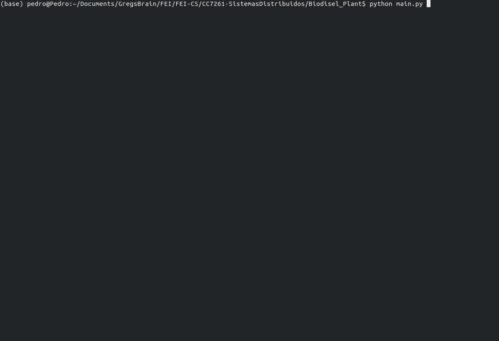

# Biodisel Plant

__Desenvolvedores:__
- Ibrahim Jamil Orra R.A.: 22.118.183-7
- Pedro Henrique Silva Domingues R.A.: 22.218.019-2



__Enunciado do projeto:__

> Desenvolver a simulação da planta quimica descrita no arquivo [SimuladoProcesso.pdf](./SimuladoProcesso.pdf) utilizando threads para cada equipamento e demonstrando os resultados para 1hr de simulação.

__Desenvolvimento:__

O projeto foi desenvolvido utilizando python 3.8.8 em um sistema operacional Linux Ubuntu 16.04.5. 

Obs: Todas as bibliotecas utilizadas são nativas do python.

__Simulação:__

Para realizar a simulação rode o arquivo [main.py](main.py).

* Caso deseje simular sem limite de tempo, comente as seguintes linhas no arquivo main.py e utilize SIGINT (Ctrl+C) para parar a simulação.

```
time.sleep(SIMULATION_TIME)
stop_variable = True
```

* Caso deseje realizar uma simulação por tempo determinado, no arquivo [main.py](main.py) defina o tempo em segundos na variavel SIMULATION_TIME.

* Para que o tempo passe mais rapido na simulação, utilize a variavel TIME_MULTIPLIER no arquivo [Components.py](Components.py).

* Uma variavel de debug também esta disponivel no arquivo [Components.py](Components.py), a qual causa atrasos em todos os componentes da planta proporcionais ao SIMULATION_TIME para que seja possivel observar as transições dos fluidos entre equipamentos.

__Resultados:__

A seguir encontram-se os resultados para 1hr de simulação.

